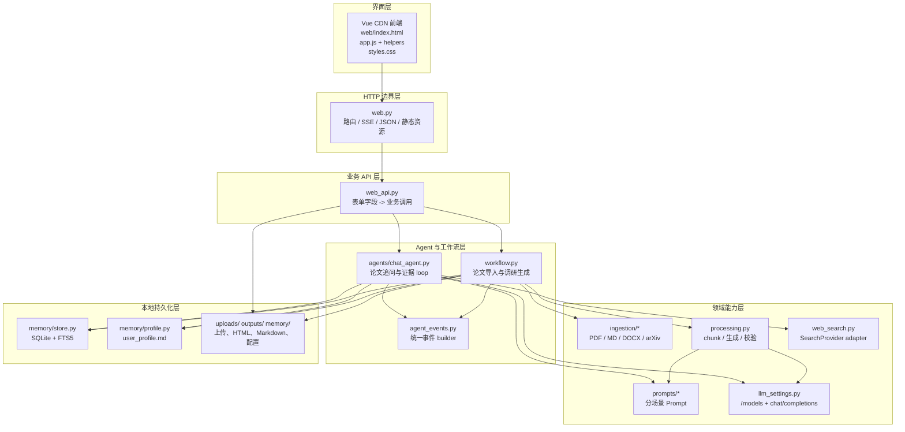
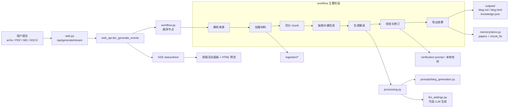
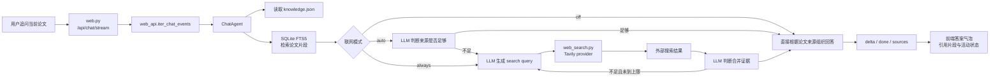
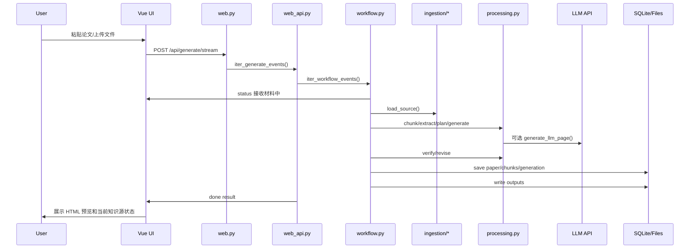
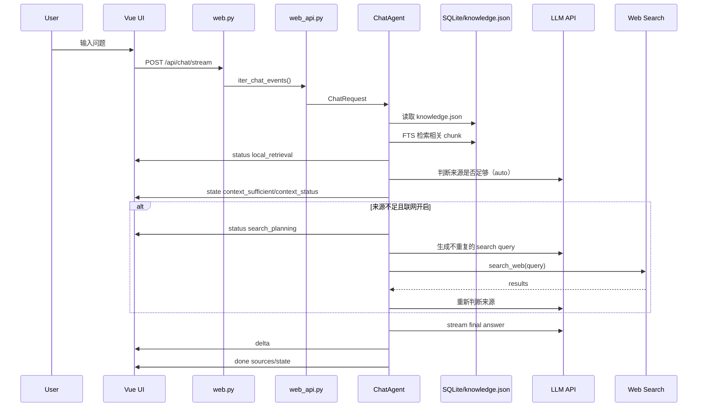

# Paper Blog Agent 架构说明

本文档说明 Paper Blog Agent 当前的整体架构、核心模块职责、数据流、Agent 执行过程、配置与持久化方式，以及后续扩展建议。

## 1. 项目定位

Paper Blog Agent 是一个本地优先的论文调研与解读工具。它可以接收 arXiv 链接或 ID、PDF、Markdown、DOCX 等材料，将论文内容整理为 Markdown 和 HTML 调研结果，并把论文知识源写入本地记忆。随后用户可以围绕当前论文继续追问：不联网时直接基于论文内容作答；自动模式由 LLM 判断证据是否足够并按需补充；总是搜索模式会先联网检索并在证据不足时继续循环补充。

项目目前是一个轻量单体应用：

- 后端：Python 标准库 HTTP server。
- 前端：Vue 3 CDN，无前端构建链。
- 本地存储：SQLite、JSON、Markdown、HTML 文件。
- LLM 接入：OpenAI-compatible `/chat/completions` 和 `/models`。
- Web Search：当前实现 Tavily provider，已预留 provider adapter 边界。

## 2. 顶层目录

```text
paper-blog-agent/
├── paper_blog_agent/
│   ├── agents/
│   │   └── chat_agent.py
│   ├── ingestion/
│   │   ├── arxiv_loader.py
│   │   ├── common.py
│   │   ├── docx_loader.py
│   │   ├── markdown_loader.py
│   │   └── pdf_loader.py
│   ├── memory/
│   │   ├── profile.py
│   │   └── store.py
│   ├── prompts/
│   │   ├── blog_generation.py
│   │   ├── context_sufficiency.py
│   │   ├── paper_chat.py
│   │   ├── verification.py
│   │   └── web_search.py
│   ├── agent_events.py
│   ├── cli.py
│   ├── exporters.py
│   ├── graph.py
│   ├── llm_settings.py
│   ├── models.py
│   ├── processing.py
│   ├── web.py
│   ├── web_api.py
│   ├── web_search.py
│   └── workflow.py
├── web/
│   ├── activities.js
│   ├── api.js
│   ├── app.js
│   ├── index.html
│   ├── markdown.js
│   ├── styles.css
│   └── theme.js
├── memory/
│   ├── llm_config.json
│   ├── papers.sqlite
│   └── user_profile.md
├── outputs/
├── uploads/
├── tests/
├── README.md
├── pyproject.toml
└── uv.lock
```

## 3. 架构总览

下面的蓝图按层级画，只展示“谁依赖谁”的主关系。生成流程和问答流程放在后面的两张图里单独展示，避免所有连线挤在一起。



### 3.1 生成调研结果蓝图



### 3.2 论文追问蓝图



## 4. 后端模块职责

### 4.1 `web.py`

`web.py` 是 HTTP 边界层，负责：

- 启动 `ThreadingHTTPServer`。
- 提供首页 `/`。
- 提供静态资源 `/assets/*`。
- 提供生成结果文件 `/generated/<paper_id>/<filename>`。
- 解析 `multipart/form-data`、`application/json`、URL encoded body。
- 返回 JSON。
- 返回 SSE。
- 将 HTTP 请求转发给 `web_api.py`。

它不再承载主要业务逻辑，业务逻辑已拆到 `web_api.py`。

主要接口：

- `GET /`
- `GET /api/history`
- `GET /api/llm/providers`
- `GET /api/llm/config`
- `GET /api/profile`
- `GET /assets/*`
- `GET /generated/*`
- `POST /api/generate`
- `POST /api/generate/stream`
- `POST /api/chat`
- `POST /api/chat/stream`
- `POST /api/llm/models`
- `POST /api/llm/config`
- `POST /api/history/delete`
- `POST /api/profile`

### 4.2 `web_api.py`

`web_api.py` 是业务 API 层，负责把 HTTP 字段转换成领域调用：

- `generate_from_submission()`：同步生成调研结果。
- `iter_generate_events()`：流式生成调研结果事件。
- `chat_with_paper()`：同步追问论文。
- `iter_chat_events()`：流式追问论文事件。
- `list_history()`：读取历史论文。
- `delete_history_item()`：删除论文历史和输出目录。
- `load_profile_settings()` / `save_profile_settings()`：读取和保存用户偏好。
- `load_llm_config_settings()` / `save_llm_config_settings()`：读取和保存模型、搜索配置。
- `search_settings_from_fields()`：从请求字段构造 Web Search 配置。
- `profile_from_fields()`：从请求字段构造用户偏好。

这一层的目标是保持可测试，不依赖 HTTP handler 实例。

### 4.3 `workflow.py`

`workflow.py` 是论文生成工作流。它将一次论文材料处理拆成顺序节点：

```text
init_context
load_user_memory
resolve_source
load_source
normalize_paper
check_cache
chunk_source_text
extract_info
save_paper_memory
plan_blog_node
generate_blog_node
verify_blog_node
revise_if_needed
export_outputs
save_knowledge_source
save_generation_history
```

每个节点接收并返回一个 `state: dict`。目前主运行路径是手写顺序执行，而不是强依赖 LangGraph。`graph.py` 提供了把同一组节点编译为 LangGraph 的辅助入口。

流式生成时，`iter_workflow_events()` 会在阶段切换时产出 SSE 事件。阶段映射由 `WORKFLOW_STAGE_BY_NODE` 定义，例如：

- 准备记忆中
- 解析来源中
- 提取内容中
- 生成解读中
- 校验来源中
- 导出结果中

### 4.4 `processing.py`

`processing.py` 是论文内容处理与生成辅助模块，负责：

- `chunk_text()`：把论文原文切成片段。
- `extract_key_info()`：从标题、摘要、片段中抽取关键描述。
- `plan_blog()`：生成博客大纲。
- `generate_blog()`：无 LLM 或 LLM 不可用时的模板化生成。
- `generate_llm_page()`：调用 LLM 生成结构化页面 JSON。
- `page_blocks_to_markdown()`：把 LLM 返回的页面 block 转 Markdown。
- `page_payload_has_substance()`：判断 LLM 页面是否有实质内容。
- `verify_blog()`：检查 Markdown 中的来源引用是否能对应 chunk。
- `revise_blog()`：在引用不足时补充来源说明。

这里已经对 LLM 返回的 `null` 列表字段做了容错，例如 `blocks: null`、`paragraphs: null`、`items: null` 会按空列表处理。

### 4.5 `agents/chat_agent.py`

`ChatAgent` 是论文追问的核心 agent。它负责：

1. 读取当前论文的 `knowledge.json`。
2. 用 SQLite FTS5 检索本地论文片段。
3. 对部分问题做启发式 chunk 增强，例如 attention 相关问题补充 Q/K/V 定义片段。
4. 调用 LLM 判断当前来源是否足够回答用户问题。
5. 根据联网触发模式决定是否规划 Web Search query。
6. 调用搜索 provider。
7. 将外部结果加入证据。
8. 再次判断来源是否足够。
9. 流式生成最终回答。

关键状态在 `ChatAgentState` 中：

```text
paper_id
question
title
knowledge
selected
snippets
web_results
context_sufficient
context_status
insufficiency_reason
missing_information
used_llm_judge
previous_queries
search_error
evidence_round
max_evidence_rounds
```

`context_status` 表示证据判断状态：`not_checked`、`sufficient`、`partial`、`insufficient`、`unavailable`。其中 `not_checked` 仅用于不联网模式，`unavailable` 表示 Judge 不可用，系统会保守地继续补证据到轮次上限，而不会把任意网页结果误判为充分。

### 4.6 `agent_events.py`

`agent_events.py` 是统一事件 builder：

- `status_event()`
- `state_event()`
- `done_event()`
- `error_event()`

生成 workflow 和 chat agent 都通过这里构造事件。这样前端只需要理解统一的事件类型：

- `status`
- `state`
- `delta`
- `done`
- `error`

### 4.7 `llm_settings.py`

`llm_settings.py` 管理 LLM provider、模型列表和 OpenAI-compatible 调用。

主要能力：

- 内置 provider 列表：DeepSeek、OpenAI、OpenRouter、Kimi、DashScope、Gemini、Groq、Custom。
- 从供应商 `/models` 获取模型列表。
- 把模型列表和 API key 保存到本地配置。
- 普通 chat completion。
- SSE stream chat completion。
- endpoint path 拼接，例如 `/chat/completions`、`/models`。

配置文件是：

```text
memory/llm_config.json
```

当前配置 schema 有 `version: 1`，方便后续迁移。

### 4.8 `web_search.py`

`web_search.py` 是联网补充模块。

当前已经抽出 provider adapter：

- `SearchProvider`
- `TavilySearchProvider`
- `SEARCH_PROVIDERS`

外部调用仍然使用：

```python
search_web(query, settings)
```

这样后续增加 Brave、Bing、SerpAPI 时，只需要新增 provider class 并注册到 `SEARCH_PROVIDERS`。

### 4.9 `memory/store.py`

`MemoryStore` 管理 SQLite 本地记忆：

- `papers`：论文元数据。
- `generations`：生成历史。
- `chunk_fts`：FTS5 chunk 索引。

主要方法：

- `upsert_paper()`
- `get_paper()`
- `save_generation()`
- `list_generations()`
- `list_recent_papers()`
- `delete_paper()`
- `index_chunks()`
- `search_chunks()`

`search_chunks()` 使用 FTS5 检索，并有一些轻量排序规则，比如降低 cover page、版权声明、作者邮箱等噪声片段的优先级。

### 4.10 `memory/profile.py`

用户偏好存储在：

```text
memory/user_profile.md
```

当前偏好包括：

- language
- default_blog_type
- target_reader
- tone
- structure
- depth
- math_level
- focus_areas

这些偏好会进入生成和问答 prompt。

### 4.11 `exporters.py`

`exporters.py` 负责把 Markdown 导出成 HTML，并写入本地产物。

输出文件：

```text
outputs/<paper_id>/blog.md
outputs/<paper_id>/blog.html
outputs/<paper_id>/verification_report.json
outputs/<paper_id>/knowledge.json
```

HTML 已支持 light/dark：

- iframe 预览会由前端注入当前主题。
- 单独打开 `/generated/.../blog.html` 时，会读取 `localStorage["paper-blog-agent.theme"]`。

## 5. 前端结构

前端仍然是无构建链的 Vue 3 CDN 方案。脚本通过普通 `<script>` 顺序加载：

```html
<script src="https://unpkg.com/vue@3/dist/vue.global.prod.js"></script>
<script src="/assets/api.js"></script>
<script src="/assets/markdown.js"></script>
<script src="/assets/activities.js"></script>
<script src="/assets/theme.js"></script>
<script src="/assets/app.js"></script>
```

### 5.1 `index.html`

负责页面结构：

- 左侧历史项目 rail。
- 顶部标题、状态、light/dark switch。
- 消息列表。
- 每条 assistant 消息上方的 agent 活动面板。
- 结果 iframe 预览。
- 引用片段折叠区。
- 底部 composer。
- 设置 drawer。

设置 drawer 分为三组：

- 模型设置
- 用户偏好
- 联网补充

### 5.2 `app.js`

`app.js` 是 Vue 应用主壳，负责：

- Vue refs 和 computed。
- 会话状态。
- 设置状态。
- SSE 读取。
- 消息入队。
- 活动面板队列。
- 生成和追问流程编排。

`app.js` 不再直接承载 Markdown 渲染、主题 HTML 注入、agent 活动摘要等工具函数。

### 5.3 `markdown.js`

负责：

- `typeLabels`
- `guessType()`
- `renderMarkdown()`

当前 Markdown 渲染是轻量实现，支持：

- 段落
- 1 到 3 级标题映射
- 无序列表
- inline code
- bold
- 简单 LaTeX inline/block 包装

### 5.4 `activities.js`

负责 agent 活动展示文案：

- `activitySummary()`
- `activityDetail()`
- `activityForEvidenceState()`

后端事件中的 `stage` 会映射为中文行为摘要，例如：

- local_retrieval -> 检索论文片段
- sufficiency_judgment -> 判断来源是否足够
- search_planning -> 规划联网检索词
- web_search -> 联网搜索补充资料
- answering -> 组织最终回答
- generation -> 整理论文材料

### 5.5 `theme.js`

负责主题逻辑：

- `normalizeTheme()`
- `applyDocumentTheme()`
- `themedResultHtmlForTheme()`

主题会保存到：

```text
localStorage["paper-blog-agent.theme"]
```

当前约定：

- `dark`：暗色。
- `light`：亮色。

### 5.6 `api.js`

目前只提供一个轻量 `jsonFetch()` helper。它是后续继续拆 API 调用的预留点。

当前 `app.js` 里仍然有不少直接 `fetch()`，后续可以继续把模型、配置、历史、聊天、生成请求逐步迁移到 `api.js`。

## 6. 生成调研结果的数据流



关键点：

- 输入会先被 `resolve_input_source()` 自动识别。
- 上传文件会写入 `uploads/`。
- 生成结果会写入 `outputs/<paper_id>/`。
- 知识源会写入 `knowledge.json`，供后续追问使用。
- chunk 会写入 SQLite FTS5。

## 7. 追问论文的数据流



## 8. 来源是否足够的 loop

`ChatAgent` 的证据 loop 由以下状态控制：

```text
context_sufficient: bool
context_status: not_checked | sufficient | partial | insufficient | unavailable
evidence_round: int
max_evidence_rounds: int
```

执行逻辑：

1. 先检索本地论文片段。
2. `off`：不调用来源充足度判断，不触发 Web Search；直接让模型按论文片段、用户问题和偏好回答。
3. `auto`：调用 LLM 判断本地证据是否足够；当状态不是 `sufficient`、未发生搜索错误且 `evidence_round < max_evidence_rounds` 时触发 Web Search。
4. `always`：先生成 query 并联网检索，再判断论文与联网证据是否足够；如果仍不足，可继续在轮次上限内补充。
5. 每一轮联网补充都会：
   - 先发出 `search_planning` 活动事件。
   - 让 LLM 根据论文标题、摘要、本地片段、当前缺口和历史 query 生成新 query。
   - 调用 Web Search。
   - 把搜索结果加入外部证据。
   - 再次判断来源是否足够。
   - 空结果仍可进入下一轮；搜索供应商报错才停止重试并回退到现有证据。
6. 最终无论是否足够，都会组织回答；如果证据不足，回答应说明限制。

## 9. 配置与持久化

### 9.1 LLM 和搜索配置

路径：

```text
memory/llm_config.json
```

结构大致为：

```json
{
  "version": 1,
  "llm": {
    "providerId": "deepseek",
    "baseUrl": "https://api.deepseek.com",
    "modelsPath": "/models",
    "apiKey": "",
    "model": "deepseek-chat",
    "models": []
  },
  "search": {
    "mode": "auto",
    "provider": "tavily",
    "apiKey": "",
    "maxResults": 5
  }
}
```

`search.mode` 当前支持：

- `off`：不联网，直接根据论文来源、用户问题和偏好回答。
- `auto`：让模型判断当前证据是否足够；不足时联网搜索并循环核对。
- `always`：先联网搜索作为参考，再判断证据；不足时继续循环补充。

`search.mode` 是唯一的联网决策字段；界面不再保留独立的“允许联网搜索”开关，避免“总是搜索”被静默降级为不联网。对话输入框和设置页绑定同一个字段，并在变更时持久化。

注意：API key 当前是本地明文保存。这适合本地原型；如果要部署给多人使用，应改成环境变量、系统 keychain 或服务端 secret storage。

### 9.2 用户偏好

路径：

```text
memory/user_profile.md
```

偏好会影响：

- 调研结果生成 prompt。
- 论文追问 prompt。

### 9.3 SQLite 记忆

路径：

```text
memory/papers.sqlite
```

主要表：

- `papers`
- `generations`
- `chunk_fts`

### 9.4 输出产物

路径：

```text
outputs/<paper_id>/
```

包含：

- `blog.md`
- `blog.html`
- `verification_report.json`
- `knowledge.json`

## 10. Prompt 组织

Prompt 已按使用场景拆分：

- `prompts/blog_generation.py`：生成调研页面。
- `prompts/context_sufficiency.py`：`auto` 和 `always` 分别使用不同的证据判断提示词；`always` 的判断发生在首轮联网后。
- `prompts/paper_chat.py`：为 `off`、`auto`、`always` 提供三套回答提示词，分别约束仅论文作答、按需补证据、联网参考必经。
- `prompts/verification.py`：校验生成内容。
- `prompts/web_search.py`：为 `auto` 和 `always` 提供不同的 query 规划提示词；`always` 要求首轮必定生成 query。

这个拆分是后续 agent 能力扩展的重要基础。新增 agent 节点时，应优先把 prompt 放在 `prompts/` 下，而不是散落在业务代码里。

## 11. 测试结构

当前测试覆盖比较完整：

- `test_architecture_boundaries.py`：架构边界约束。
- `test_web_app.py`：Web API 行为。
- `test_frontend_markup.py`：前端结构和关键交互。
- `test_llm_settings.py`：provider、模型列表、配置持久化。
- `test_llm_generation.py`：LLM 生成页面和容错。
- `test_llm_chat.py`：问答、流式输出、Web Search loop。
- `test_chat_agent.py`：ChatAgent 事件和证据逻辑。
- `test_fts_retrieval.py`：SQLite FTS 检索。
- `test_ingestion.py`：材料加载。
- `test_memory_and_workflow.py`：本地记忆和生成工作流。
- `test_prompts.py`：Prompt 内容约束。

常用验证命令：

```bash
node --check web/app.js
node --check web/api.js
node --check web/markdown.js
node --check web/activities.js
node --check web/theme.js
uv run python -m unittest discover -s tests -v
```

## 12. 当前架构优点

1. 轻量：没有复杂部署和构建链，本地启动快。
2. 可解释：生成 workflow 是显式节点，容易调试。
3. 本地优先：论文、chunk、历史、配置都在本地。
4. Prompt 已拆分：便于迭代不同 agent 节点。
5. 事件模型统一：前端可以用统一方式展示 agent 进度。
6. 搜索 provider 有边界：后续可扩展多个搜索服务。
7. 测试覆盖足够支撑继续重构。

## 13. 当前架构限制

1. 前端仍然是 CDN + 全局对象模式
   这适合轻量原型，但规模继续变大后，缺少模块系统、类型检查和组件拆分。

2. `app.js` 仍然偏大
   虽然工具函数已拆出，但聊天流、生成流、设置保存、活动队列仍集中在一个 Vue setup 中。

3. HTTP server 是标准库手写路由
   足够简单，但随着接口增加，会不如 FastAPI/Starlette 这类框架易维护。

4. API key 明文保存
   本地工具可以接受，多用户部署不合适。

5. 生成 workflow 和 chat agent 仍然是两种组织方式
   事件已统一，但节点抽象还没完全统一。

6. Web Search 当前只有 Tavily 实现
   Provider adapter 已有，但 Brave/Bing/SerpAPI 尚未实现。

## 14. 后续优化建议

### 14.1 继续拆前端

建议下一步把 `app.js` 继续拆成 composable 风格，即使不引入构建链，也可以用全局模块承载不同职责：

- `chat_state.js`
- `settings_state.js`
- `sse.js`
- `history.js`
- `models.js`

这样 Vue setup 会更像组合入口。

### 14.2 抽统一 SSE reader

当前生成和追问都手写了读取 SSE 的逻辑。可以抽成：

```javascript
readSse(response, {
  onStatus,
  onState,
  onDelta,
  onDone,
  onError
})
```

这样可以减少重复，并统一错误处理。

### 14.3 将 workflow 节点对象化

现在 workflow 节点是函数，状态是 dict。后续可以逐步引入：

- 明确的 state dataclass 或 TypedDict。
- node metadata，例如 `id`、`stage_label`、`summary`。
- node 统一事件输出。

### 14.4 增加更多 SearchProvider

建议新增：

- `BraveSearchProvider`
- `BingSearchProvider`
- `SerpApiSearchProvider`

统一返回：

```python
{
  "status": "ok",
  "results": [
    {"title": "...", "url": "...", "content": "..."}
  ]
}
```

### 14.5 配置迁移机制

当前已有 `version: 1`。后续可以增加：

```python
def migrate_config(payload):
    ...
```

当配置字段变更时，不需要在前端和后端各处做兼容分支。

### 14.6 密钥管理

如果项目从本地原型变成多人使用，建议：

- API key 不再保存到 JSON。
- 使用环境变量或 keychain。
- 前端不回显完整 key。
- 后端返回 masked key 状态。

## 15. 开发与运行

启动 Web：

```bash
uv run python -m paper_blog_agent.web --port 8766
```

打开：

```text
http://127.0.0.1:8766/
```

命令行生成：

```bash
uv run python -m paper_blog_agent.cli path/to/paper.md
uv run python -m paper_blog_agent.cli 1706.03762 --blog-type technical
```

运行测试：

```bash
uv run python -m unittest discover -s tests -v
```

前端语法检查：

```bash
node --check web/app.js
node --check web/api.js
node --check web/markdown.js
node --check web/activities.js
node --check web/theme.js
```

## 16. 一句话总结

Paper Blog Agent 当前已经从单文件 demo 演进成一个边界清晰的本地 agent 原型：生成链路、问答 agent、prompt、记忆、搜索、前端交互都已有独立职责。后续最值得继续投入的是前端状态拆分、SSE reader 抽象、更多 search provider，以及更安全的配置与密钥管理。
